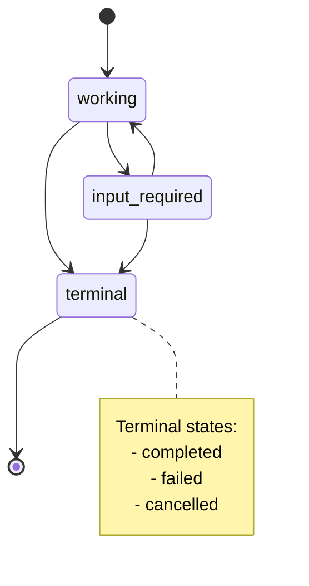

# Tasks

::: tip Note
**This document is part of the Tasks extension (`io.modelcontextprotocol/tasks`).**

This extension allows a server to respond to a `tools/call` request with an asynchronous _task handle_ instead of a final result, allowing the client to retrieve the eventual result by polling. The extension introduces three methods: `tasks/get`, `tasks/update`, and `tasks/cancel`; a polymorphic-result discriminator (`resultType: "task"`); and a `Task` shape that carries a task status, in-progress server-to-client requests, and a final result or error.

Task creation is server-directed: the client signals support by including the extension in its per-request capabilities, and the server decides on a per-request basis whether to materialize a task.
:::

The Model Context Protocol (MCP) Tasks extension allows certain requests to be augmented with **tasks**. Tasks are durable state machines that carry information about the underlying execution state of the request they augment, and are intended for client polling and deferred result retrieval. Each task is uniquely identifiable by a server-generated **task ID**.

Tasks are useful for representing expensive computations and batch processing requests, and map naturally onto external job APIs.

## Extension Identifier

This extension is identified as: `io.modelcontextprotocol/tasks`.

## Capability Negotiation

The client and server declare support for the tasks extension in their respective capabilities objects:

```jsonc
// Client to server, in per-request capabilities
{
  // Other request parameters...
  "params": {
    "_meta": {
      "io.modelcontextprotocol/clientCapabilities": {
        "extensions": {
          "io.modelcontextprotocol/tasks": {},
        },
      },
    },
  },
}
```

```jsonc
// Server to client, in response to server/discover
{
  "result": {
    // Other response parameters...
    "capabilities": {
      "extensions": {
        "io.modelcontextprotocol/tasks": {},
      },
    },
  },
}
```

No extension-specific settings are currently defined; an empty object indicates support.

A server that has negotiated this extension **MAY** return `CreateTaskResult` in lieu of a standard result (e.g. `CallToolResult`) in response to any supported request at its own discretion and on a per-request basis. The server is the sole decider; clients do not signal task preference on the request itself. The client declaring the extension capability does not suggest that it requires a `CreateTaskResult` in response to that request.

A server **MUST NOT** return `CreateTaskResult` to a client that did not include the extension capability on its request, regardless of prior declarations. A client that has negotiated this extension **MUST** be prepared to handle either `CallToolResult` or `CreateTaskResult` in response to any supported request it issues. A client that receives `CreateTaskResult` in response to an unsupported request type **MUST** interpret this as an invalid response to the request.

If a server is unable to service a request to a client that does not declare this extension capability without returning `CreateTaskResult`, the server **MUST** return an error with the code `-32003` (Missing Required Client Capability), indicating the required extension in the error response:

```jsonl
{
  "jsonrpc": "2.0",
  "id": 1,
  "error": {
    // MISSING_REQUIRED_CLIENT_CAPABILITY
    "code": -32003,
    // Message provided for example purposes only. The content of this example message is non-normative.
    "message": "Missing required client capability",
    "data": {
      "requiredCapabilities": {
        "extensions": {
          "io.modelcontextprotocol/tasks": {}
        }
      }
    }
  }
}
```

## Supported Methods

The following methods currently support task-augmented execution:

- `tools/call`

This specification may be extended to support tasks over other request types in the future; implementations **SHOULD** be designed to accommodate additional request types in future revisions of this specification.

## Polymorphic Results

A request that is eligible for task-augmentation may return one of two distinct result shapes — the request's standard result, or a `CreateTaskResult`. The discriminator is the `resultType` field on the result object:

```typescript
// "task" is introduced by this extension.
type ResultType = "complete" | "input_required" | "task" | string;
```

Servers **MUST** set `resultType` to `"task"` when returning a `CreateTaskResult` so that clients can distinguish it from a standard result. Servers **MUST NOT** set `resultType` to `"task"` on result types other than `CreateTaskResult`.

## Tasks

A `Task` carries operational metadata about ongoing work.

```typescript
interface Task {
  /** Stable identifier for this task. */
  taskId: string;

  /** Current task status. */
  status: "working" | "input_required" | "completed" | "cancelled" | "failed";

  /**
   * Optional message describing the current task state.
   * This can provide context for any status, for example (non-normative):
   * - Progress descriptions for "working"
   * - Work blocked on "input_required"
   * - Reasons for "cancelled" status
   * - Summaries for "completed" status
   * - Additional information for "failed" status (e.g., error details, what went wrong)
   *
   * This MAY be exposed to the end-user or model.
   */
  statusMessage?: string;

  /** ISO 8601 timestamp when the task was created. */
  createdAt: string;

  /** ISO 8601 timestamp when the task was last updated. */
  lastUpdatedAt: string;

  /**
   * Time-to-live duration from creation in integer milliseconds, null for unlimited.
   * The server may discard the task after the TTL elapses. This value MAY change
   * over the lifetime of a task.
   */
  ttlMs: number | null;

  /**
   * Suggested polling interval in integer milliseconds. Clients SHOULD honor
   * this value to avoid overwhelming the server. This value MAY change over
   * the lifetime of a task.
   */
  pollIntervalMs?: number;
}
```

### Task Status

Tasks can be in one of the following states:

- `working`: The request is currently being processed.
- `input_required`: The server needs input from the client. The `tasks/get` response will include outstanding requests in the `inputRequests` field, and the client should provide responses via the `inputResponses` field in subsequent `tasks/update` requests.
- `completed`: The request completed successfully and results are available in the `result` field. This includes tool calls that returned results with `isError: true`.
- `failed`: The request failed due to a JSON-RPC error during execution. The task will include the `error` field with the JSON-RPC error details. This status **MUST NOT** be used for non-JSON-RPC errors.
- `cancelled`: The request was cancelled before completion.

Derived shapes of `Task` inline status-specific payload fields and are used by `tasks/get` responses and `notifications/tasks` notifications:

```ts
/**
 * A task that is in a normal working state.
 * Used by tasks/get and notifications/tasks.
 */
export interface WorkingTask extends Task {
  status: "working";
}

/**
 * A task that is waiting for input from the client.
 * Used by tasks/get and notifications/tasks.
 */
export interface InputRequiredTask extends Task {
  status: "input_required";
  /**
   * Server-to-client requests that need to be fulfilled during task execution.
   * Keys are arbitrary identifiers for matching requests to responses.
   */
  inputRequests: InputRequests;
}

/**
 * A task that has completed successfully.
 * Used by tasks/get and notifications/tasks.
 */
export interface CompletedTask extends Task {
  status: "completed";
  /**
   * The final result of the task.
   * The structure matches the result type of the original request.
   * For example, a CallToolRequest task would return the CallToolResult structure.
   */
  result: JSONObject;
}

/**
 * A task that has failed due to a JSON-RPC error.
 * Used by tasks/get and notifications/tasks.
 */
export interface FailedTask extends Task {
  status: "failed";
  /**
   * The JSON-RPC error that caused the task to fail.
   */
  error: JSONObject;
}

/**
 * A task that has been cancelled.
 * Used by tasks/get and notifications/tasks.
 */
export interface CancelledTask extends Task {
  status: "cancelled";
}

/**
 * A union type representing a task with optional inlined result/error/inputRequests fields.
 * This type is used by tasks/get and notifications/tasks to provide complete task state
 * including terminal results or pending input requests.
 */
export type DetailedTask =
  | WorkingTask
  | InputRequiredTask
  | CompletedTask
  | FailedTask
  | CancelledTask;
```

**Task Status State Diagram:**



## Task Creation

A server returns `CreateTaskResult` in lieu of the standard result shape for a request to indicate that request will be processed asynchronously.

```typescript
// resultType: "task"
type CreateTaskResult = Result & Task;
```

**Example Request (CallToolRequest):**

```json
{
  "jsonrpc": "2.0",
  "id": 1,
  "method": "tools/call",
  "params": {
    "name": "get_weather",
    "arguments": {
      "city": "New York"
    }
  }
}
```

**Example Response (CreateTaskResult):**

```json
{
  "jsonrpc": "2.0",
  "id": 1,
  "result": {
    "resultType": "task",
    "taskId": "786512e2-9e0d-44bd-8f29-789f320fe840",
    "status": "working",
    "statusMessage": "The operation is now in progress.",
    "createdAt": "2025-11-25T10:30:00Z",
    "lastUpdatedAt": "2025-11-25T10:40:00Z",
    "ttlMs": 60000,
    "pollIntervalMs": 5000
  }
}
```

The embedded `task` is the seed state for the task, typically (though not necessarily) with `status: "working"`. The client uses `task.taskId` for all subsequent `tasks/get`, `tasks/update`, and `tasks/cancel` calls.

A server **MUST NOT** return `CreateTaskResult` until the task is durably created — that is, until a `tasks/get` for the returned `taskId` would resolve. In eventually-consistent environments, the server **MUST** wait for consistency before responding. This requirement eliminates the need for clients to speculatively poll for task creation.

Server implementations that use multi round-trip requests in conjunction with task creation (for example, a tool that requires elicitation over `InputRequiredResult` before creating a task) **SHOULD** resolve all MRTR exchanges _synchronously_ before responding with a `CreateTaskResult`.

## Task Polling

Clients poll for task completion by sending `tasks/get` requests.

Clients **SHOULD** respect the `pollIntervalMs` provided in responses when determining polling frequency. The `pollIntervalMs` **MAY** change over the lifetime of a task. Servers **MAY** rate-limit clients polling more frequently than the recorded `pollIntervalMs`.

Clients **SHOULD** continue polling until the task reaches a terminal status or until invoking `tasks/cancel`. Clients **SHOULD** persist task IDs to durable storage so that polling can resume after a crash or restart.

### Request

```typescript
interface GetTaskRequest extends JSONRPCRequest {
  method: "tasks/get";
  params: {
    /** Identifier of the task to query. */
    taskId: string;
  };
}
```

### Response

Upon receiving a `tasks/get` request, the server **MUST** check the status of the task and respond accordingly:

1. If the status is `working`, the server **MUST** return a a `Task` object with status `working`.
2. If the status is `input_required`, the server **MUST** return a `Task` object with status `input_required` and an `inputRequests` field defined in [Multi Round-Trip Requests](https://modelcontextprotocol.io/specification/draft/basic/utilities/mrtr). The `inputRequests` field **MUST** contain all outstanding requests from the server to the client that need to be fulfilled before the task can proceed.
3. If the status is `completed`, the server **MUST** return a `Task` object with status `completed` and a `result` field containing the final result of the task.
4. If the status is `cancelled`, the server **MUST** return a `Task` object with status `cancelled`.
5. If the status is `failed`, the server **MUST** return a `Task` object with status `failed` and the error that occurred during execution.

```typescript
type GetTaskResult = Result & DetailedTask;
```

The response carries the appropriate response variant for the task's current status (see [Task Status](#task-status)). The `resultType` field **MUST** be set to `"complete"` on this object as it is the standard result shape for the `tasks/get` request.

If the task has a non-null `ttlMs`, clients **MAY** treat the TTL as a backstop: if the task's observable status has not reflected the update after `createdAt` plus `ttlMs` has elapsed, the client **MAY** consider the task to no longer be usable. Conversely, servers **MAY** mark a task as `failed` at any point after the TTL elapses, and subsequently delete it at any time. The value of `ttlMs` **MAY** change over the lifetime of a task.

## Task Update Requests

When a task requires input from the client (indicated by the `input_required` status), the server includes outstanding requests in the `inputRequests` field of the `tasks/get` response (see [Multi Round-Trip Requests](https://modelcontextprotocol.io/specification/draft/basic/utilities/mrtr)). The client provides responses via the `inputResponses` field in one or more subsequent `tasks/update` requests.

When a client observes a `tasks/get` response (or `notifications/tasks` notification) with `status: "input_required"`, the client **SHOULD** fulfill the outstanding requests in `inputRequests` by sending one or more `tasks/update` requests with corresponding `inputResponses`. After sending a `tasks/update`, the client **SHOULD** continue observing the task's status via polling (`tasks/get`) or notifications (`notifications/tasks`) until it reaches a terminal state.

Clients **MUST** treat each entry in `inputRequests` as they would the equivalent standalone server-to-client request — for example, an elicitation request surfaced via `inputRequests` is subject to the same trust model and user-facing behavior as a direct `elicitation/create` request. Clients **SHOULD** deduplicate `inputRequests` keys across consecutive polls to avoid presenting the same request to the user or model more than once.

Each request key in `inputRequests` **MUST** be unique over the lifetime of a single task. A server **MUST NOT** reuse a key for a subsequent server-to-client request after a response for that key has been delivered, and **MUST NOT** use the same key to refer to two distinct requests over a task's lifetime. This guarantees that `inputResponses` keyed by the same identifier always refer to the request the client expects, eliminates ambiguity for clients deduplicating across polls, and lets servers ignore `inputResponses` for unknown or already-satisfied requests.

### Request

```typescript
interface UpdateTaskRequest extends JSONRPCRequest {
  method: "tasks/update";
  params: {
    /** Identifier of the task to update. */
    taskId: string;

    /**
     * Responses to outstanding inputRequests previously surfaced by the
     * server. Shape per MRTR. Each key MUST correspond to a currently-
     * outstanding inputRequest key.
     */
    inputResponses: InputResponses;
  };
}
```

### Response

```typescript
type UpdateTaskResult = Result; // empty acknowledgement
```

On success, the server **MUST** acknowledge the request with an empty result. The acknowledgement is _eventually consistent_: the server **MAY** accept the responses and return the ack before the task's observable status (via `tasks/get` or `notifications/tasks`) reflects them. Servers **SHOULD** return a JSON-RPC error if the `taskId` does not correspond to a known task. Clients **SHOULD** track `inputRequests` keys to avoid responding to requests more than once.

A server **SHOULD** ignore any `inputResponses` responses mapped to a key that is not currently outstanding for the task — including keys that were never issued, keys that have already been answered, and keys whose corresponding request has been superseded. A server **MAY** accept a partial set of responses (a strict subset of currently-outstanding keys); in that case the task remains in `input_required` until the remaining responses arrive.

The `resultType` field **MUST** be set to `"complete"` on `UpdateTaskResult` as it is the standard result shape for the `tasks/update` request.

## Task Cancellation

A client sends a `tasks/cancel` request to signal its intent to cancel an in-progress task. The `notifications/cancelled` notification **MUST NOT** be used for task cancellation.

### Request

```typescript
interface CancelTaskRequest extends JSONRPCRequest {
  method: "tasks/cancel";
  params: {
    taskId: string;
  };
}
```

### Response

```typescript
type CancelTaskResult = Result; // empty acknowledgement
```

On success, the server **MUST** acknowledge the request with an empty result. Servers **SHOULD** return a JSON-RPC error if the `taskId` does not correspond to a known task. Cancellation processing is _eventually consistent_ — the task's observable status **MAY** remain `working` (or some other non-terminal status) after the ack, and **MAY** ultimately reach a terminal status other than `cancelled` if the work finished before cancellation could take effect.

Cancellation is **cooperative**: The request signals intent, and the server decides whether and when to honor it. A server is not obligated to actually stop the work; it is only obligated to acknowledge the request. Eventual transition to `cancelled` is not guaranteed.

Clients **MAY** delete all state associated with the task as soon as they send a cancellation (e.g., it no longer needs to retain the list of `inputRequests` keys that it has already responded to). The client does not need to poll `tasks/get` again to wait for the task to reach the `cancelled` state.

The `resultType` field **MUST** be set to `"complete"` on `CancelTaskResult` as it is the standard result shape for the `tasks/cancel` request.

## Task Status Notifications

Servers **MAY** push status updates via `notifications/tasks` notifications in addition to servicing client polls:

```typescript
export type TaskStatusNotificationParams = NotificationParams & Task;

export interface TaskStatusNotification extends JSONRPCNotification {
  method: "notifications/tasks";
  params: TaskStatusNotificationParams;
}
```

To begin listening for task status notifications, clients send a `subscriptions/listen` request to the server including a list of task IDs the client is interested in:

```typescript
export interface SubscriptionsListenRequest extends Request {
  method: "subscriptions/listen";
  params: {
    // Other existing fields...
    notifications: {
      taskIds?: string[];
      // Other existing fields...
    };
  };
}
```

In its acknowledgement notification, the server includes the list of task IDs it has agreed to send task status notifications for, if any:

```typescript
export interface SubscriptionsAcknowledgedNotification extends Notification {
  method: "notifications/subscriptions/acknowledged";
  params: {
    notifications: {
      /**
       * Subscribe to notifications/tasks for specific task IDs.
       */
      taskIds?: string[];
      // Other existing fields...
    };
  };
}
```

If a client requests task status notifications but does not declare the `io.modelcontextprotocol/tasks` extension capability, the server **MUST** return a JSON-RPC error specifying the missing capabilities:

```json
{
  "jsonrpc": "2.0",
  "id": 12,
  "error": {
    "code": -32003,
    "message": "Missing required client capability",
    "data": {
      "requiredCapabilities": {
        "extensions": {
          "io.modelcontextprotocol/tasks": {}
        }
      }
    }
  }
}
```

Each notification carries a complete `DetailedTask` for the current status, identical to what `tasks/get` would have returned at that moment.

**Notification:**

```json
{
  "jsonrpc": "2.0",
  "method": "notifications/tasks",
  "params": {
    "taskId": "786512e2-9e0d-44bd-8f29-789f320fe840",
    "status": "completed",
    "createdAt": "2025-11-25T10:30:00Z",
    "lastUpdatedAt": "2025-11-25T10:50:00Z",
    "ttlMs": 60000,
    "pollIntervalMs": 5000,
    "result": {
      "content": [
        {
          "type": "text",
          "text": "Operation completed successfully."
        }
      ],
      "isError": false
    }
  }
}
```

The notification includes the full task object, allowing clients to access the complete task state and final results without polling the `tasks/get` method. Clients **MAY** continue polling `tasks/get` in addition to subscribing to task status notifications, but need not do so.

`notifications/progress` and `notifications/message` notifications **MUST NOT** be sent on the `subscriptions/listen` stream for a task, and are not supported on tasks in general in this specification.

## Streamable HTTP: Routing Headers

When `tasks/get`, `tasks/update`, or `tasks/cancel` is sent over the Streamable HTTP transport, the client **MUST** set the `Mcp-Name` header to the value of `params.taskId`. This allows transport intermediaries and load balancers to route subsequent requests for the same task to the server instance holding its state, which is typically required for correctness. The `Mcp-Method` header is set to the JSON-RPC method name per standard header conventions.

## Example Message Flow

Consider a simple tool call, `hello_world`, requiring an elicitation for the user to provide their name. The tool itself takes no arguments.

To invoke this tool, the client makes a `CallToolRequest` as follows:

```jsonc
{
  "jsonrpc": "2.0",
  "id": 2,
  "method": "tools/call",
  "params": {
    "name": "hello_world",
    "arguments": {},
    "_meta": {
      // Other metadata...
      "io.modelcontextprotocol/clientCapabilities": {
        "extensions": {
          "io.modelcontextprotocol/tasks": {},
        },
      },
    },
  },
}
```

The server determines (via bespoke logic) that it wants to create a task to represent this work, and it immediately returns a `CreateTaskResult`:

```json
{
  "jsonrpc": "2.0",
  "id": 2,
  "result": {
    "resultType": "task",
    "taskId": "786512e2-9e0d-44bd-8f29-789f320fe840",
    "status": "working",
    "createdAt": "2025-11-25T10:30:00Z",
    "lastUpdatedAt": "2025-11-25T10:50:00Z",
    "ttlMs": 3600000,
    "pollIntervalMs": 5000
  }
}
```

Once the client receives the `CreateTaskResult`, it begins polling `tasks/get`:

```json
{
  "jsonrpc": "2.0",
  "id": 3,
  "method": "tasks/get",
  "params": {
    "taskId": "786512e2-9e0d-44bd-8f29-789f320fe840"
  }
}
```

On each request while the task is in a `"working"` status, the server returns a regular task response:

```json
{
  "jsonrpc": "2.0",
  "id": 3,
  "result": {
    "resultType": "complete",
    "taskId": "786512e2-9e0d-44bd-8f29-789f320fe840",
    "status": "working",
    "createdAt": "2025-11-25T10:30:00Z",
    "lastUpdatedAt": "2025-11-25T10:50:00Z",
    "ttlMs": 3600000,
    "pollIntervalMs": 5000
  }
}
```

Eventually, the server reaches the point at which it needs to send an elicitation to the user. It sets the task status to `"input_required"` to signal this. On the next `tasks/get` request from the client, the server sends the elicitation payload via the `inputRequests` field.

::: tip Note
While task `inputRequests` share structural similarities with multi round-trip requests, they are a distinct mechanism: task `inputRequests` are surfaced via `tasks/get` and fulfilled via `tasks/update`, not via retries of the original method. A server that needs client input _before_ returning a `CreateTaskResult` (e.g. to decide whether to proceed) uses the multi round-trip request flow on the original request; a server that needs client input _during_ task execution uses the `inputRequests`/`inputResponses` mechanism described here.
:::

```json
{
  "jsonrpc": "2.0",
  "id": 4,
  "method": "tasks/get",
  "params": {
    "taskId": "786512e2-9e0d-44bd-8f29-789f320fe840"
  }
}
```

```json
{
  "id": 4,
  "jsonrpc": "2.0",
  "result": {
    "resultType": "complete",
    "taskId": "786512e2-9e0d-44bd-8f29-789f320fe840",
    "status": "input_required",
    "createdAt": "2025-11-25T10:30:00Z",
    "lastUpdatedAt": "2025-11-25T10:50:00Z",
    "ttlMs": 3600000,
    "pollIntervalMs": 5000,
    "inputRequests": {
      "name": {
        "method": "elicitation/create",
        "params": {
          "mode": "form",
          "message": "Please enter your name.",
          "requestedSchema": {
            "type": "object",
            "properties": {
              "name": { "type": "string" }
            },
            "required": ["name"]
          }
        }
      }
    }
  }
}
```

For thoroughness, consider a case where the client happens to poll `tasks/get` again _before_ the user has fulfilled the elicitation request. As `inputRequests` is effectively a point-in-time snapshot of all outstanding server-to-client requests associated with the task, the server includes the same request again, despite the client having already seen this information (the client is advised to deduplicate `inputRequests` with the same key for UX purposes):

```json
{
  "jsonrpc": "2.0",
  "id": 5,
  "method": "tasks/get",
  "params": {
    "taskId": "786512e2-9e0d-44bd-8f29-789f320fe840"
  }
}
```

```json
{
  "id": 5,
  "jsonrpc": "2.0",
  "result": {
    "resultType": "complete",
    "taskId": "786512e2-9e0d-44bd-8f29-789f320fe840",
    "status": "input_required",
    "createdAt": "2025-11-25T10:30:00Z",
    "lastUpdatedAt": "2025-11-25T10:50:00Z",
    "ttlMs": 3600000,
    "pollIntervalMs": 5000,
    "inputRequests": {
      "name": {
        "method": "elicitation/create",
        "params": {
          "mode": "form",
          "message": "Please enter your name.",
          "requestedSchema": {
            "type": "object",
            "properties": {
              "name": { "type": "string" }
            },
            "required": ["name"]
          }
        }
      }
    }
  }
}
```

The user enters their name, and the client makes a `tasks/update` request with the satisfied information:

```json
{
  "jsonrpc": "2.0",
  "id": 6,
  "method": "tasks/update",
  "params": {
    "taskId": "786512e2-9e0d-44bd-8f29-789f320fe840",
    "inputResponses": {
      "name": {
        "action": "accept",
        "content": {
          "input": "Luca"
        }
      }
    }
  }
}
```

The server acknowledges the request:

```json
{
  "jsonrpc": "2.0",
  "id": 6,
  "result": {
    "resultType": "complete"
  }
}
```

Asynchronously, the server processes the input and moves the task back into the `working` status:

```json
{
  "jsonrpc": "2.0",
  "id": 7,
  "method": "tasks/get",
  "params": {
    "taskId": "786512e2-9e0d-44bd-8f29-789f320fe840"
  }
}
```

```json
{
  "id": 7,
  "jsonrpc": "2.0",
  "result": {
    "resultType": "complete",
    "taskId": "786512e2-9e0d-44bd-8f29-789f320fe840",
    "status": "working",
    "createdAt": "2025-11-25T10:30:00Z",
    "lastUpdatedAt": "2025-11-25T10:50:00Z",
    "ttlMs": 3600000,
    "pollIntervalMs": 5000
  }
}
```

Eventually, the server completes the request, so it stores the final `CallToolResult` and moves the task into the `"completed"` status. On the next `tasks/get` request, the server sends the final tool result inlined into the task object:

```json
{
  "jsonrpc": "2.0",
  "id": 8,
  "method": "tasks/get",
  "params": {
    "taskId": "786512e2-9e0d-44bd-8f29-789f320fe840"
  }
}
```

```json
{
  "jsonrpc": "2.0",
  "id": 8,
  "result": {
    "resultType": "complete",
    "taskId": "786512e2-9e0d-44bd-8f29-789f320fe840",
    "status": "completed",
    "createdAt": "2025-11-25T10:30:00Z",
    "lastUpdatedAt": "2025-11-25T10:50:00Z",
    "ttlMs": 3600000,
    "pollIntervalMs": 5000,
    "result": {
      "content": [
        {
          "type": "text",
          "text": "Hello, Luca!"
        }
      ],
      "isError": false
    }
  }
}
```

## Error Handling

Tasks use two error reporting mechanisms:

1. **Protocol Errors**: Standard JSON-RPC errors for protocol-level issues
2. **Task Execution Errors**: Errors in the underlying request execution, reported through task status

### Protocol Errors

Servers **MUST** return standard JSON-RPC errors for the following protocol error cases:

- Invalid or nonexistent `taskId`: `-32602` (Invalid params)
  - Servers **MUST** return this error for `tasks/get`.
  - Servers **SHOULD** return this error for `tasks/update` and `tasks/cancel`.
- Internal errors: `-32603` (Internal error)
- Missing required client capabilities: `-32003` (Missing Required Client Capability)
  - Servers **MUST** return this error for non-declaring clients requesting task notifications on `subscriptions/listen`.
  - Servers **MUST** return this error for non-declaring clients issuing `tasks/get`, `tasks/update`, and `tasks/cancel` requests.

Servers **SHOULD** provide informative error messages to describe the cause of errors.

**Example: Task not found**

```json
{
  "jsonrpc": "2.0",
  "id": 70,
  "error": {
    "code": -32602,
    "message": "Failed to retrieve task: Task not found"
  }
}
```

**Example: Task expired**

```json
{
  "jsonrpc": "2.0",
  "id": 71,
  "error": {
    "code": -32602,
    "message": "Failed to retrieve task: Task has expired"
  }
}
```

::: tip Note
Servers are not required to retain tasks indefinitely. It is compliant behavior for a server to return an error stating the task cannot be found if it has purged an expired task.
:::

### Task Execution Errors

When the underlying request encounters a JSON-RPC protocol error during execution, the task moves to the `failed` status. The `tasks/get` response **SHOULD** include a `statusMessage` field with diagnostic information about the failure, and **MUST** include the `error` field with the JSON-RPC error.

The `failed` status **MUST NOT** be used to represent non-JSON-RPC errors, such as a tool result that completed with `isError: true`. Errors within the context of a protocol method result **MUST** use the `completed` status with the error details in the `result` field. This maintains a strong separation between protocol-level faults (which use the `failed` status) and other faults.

**Example: Task with JSON-RPC execution error**

```json
{
  "jsonrpc": "2.0",
  "id": 4,
  "result": {
    "resultType": "task",
    "taskId": "786512e2-9e0d-44bd-8f29-789f820fe840",
    "status": "failed",
    "createdAt": "2025-11-25T10:30:00Z",
    "lastUpdatedAt": "2025-11-25T10:40:00Z",
    "ttlMs": 3600000,
    "statusMessage": "Tool execution failed: API rate limit exceeded",
    "error": {
      "code": -32603,
      "message": "API rate limit exceeded"
    }
  }
}
```

**Example: Tool call completed with tool error (isError: true)**

For tool calls that complete successfully at the protocol level but return a tool-level error (indicated by `isError: true` in the tool result), the task reaches `completed` status with the tool result in the `result` field:

```json
{
  "jsonrpc": "2.0",
  "id": 5,
  "result": {
    "resultType": "task",
    "taskId": "786512e2-9e0d-44bd-8f29-789f820fe840",
    "status": "completed",
    "createdAt": "2025-11-25T10:30:00Z",
    "lastUpdatedAt": "2025-11-25T10:40:00Z",
    "ttlMs": 3600000,
    "result": {
      "content": [
        {
          "type": "text",
          "text": "Failed to process request: invalid input"
        }
      ],
      "isError": true
    }
  }
}
```

The `tasks/get` endpoint returns exactly what the underlying request would have returned:

- If the underlying request resulted in a JSON-RPC error, the task uses `failed` status and the `error` field **MUST** contain that JSON-RPC error.
- If the request completed with a result (even if `isError: true` for tool results), the task uses `completed` status and the `result` field **MUST** contain that result.

## Reservations

- The `tasks/` method prefix and `notifications/tasks/` notification prefix are reserved for this extension.
- The result-discriminator value `"task"` for `resultType` is reserved for this extension.
- The label `io.modelcontextprotocol/tasks` is reserved for this extension.

## Security Considerations

- **Task ID unguessability.** A server **MAY** use task IDs as bearer tokens for a server's stored state. Servers **MUST** generate them with sufficient entropy that a third party cannot enumerate or guess them.
- **Cross-caller correlation.** Because there is no `tasks/list`, a server cannot inadvertently leak the existence of one caller's tasks to another. This is an improvement over the `2025-11-25` tasks specification, in which a poorly-scoped list could expose unrelated task IDs.
- **Input-request trust model.** `inputRequests` carry elicitation and sampling payloads from the server through the client to the user or model. Hosts **MUST** apply the same trust model to these payloads as they would to standard elicitation/sampling requests. A task is not a higher-trust channel.

## Implementation Considerations

### Backwards Compatibility

- `2025-11-25` client implementations returning fixed shapes (e.g., a `tools/call` method returning `CallToolResult`) need not change their public method contracts — they can transparently drive the polling flow internally and surface only the final, completed result. New implementation surfaces can then expose the task lifecycle directly for applications able to leverage it.
